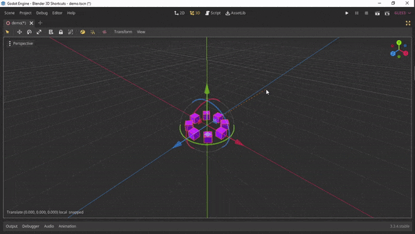
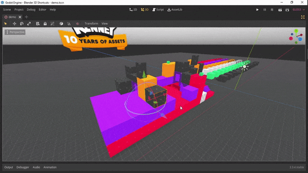
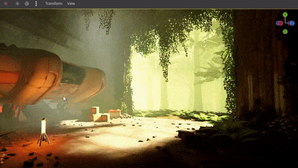

# Blender 3D Shortcuts in Godot

Blender's 3D transforming shortcuts in Godot





> ⚠️ This version is only compatible with **Godot 3.x**, check out [master](https://github.com/imjp94/gd-blender-3d-shortcuts/tree/master) branch for latest version

## Features

- Transform with "G", "R", "S" keys and "H" key to hide
- Revert transformation with "ALT" modifier
- Visualize constraint axis
- Work seamlessly with Godot Spatial Editor settings("Use Local Space", "Use Snap", "Snap Settings")
- Type transform value
- Switch display mode with "Z"

## Installation

1. Install directly from Godot Asset Library

or

1. Download this respository, move `addons/blender_3d_shortcuts` to your `{project_dir}`

2. Enable it from Project -> Settings -> Plugins

3. (Optional) Clear spatial editor scale mode shortcut as it conflicts with rotate shortcut, Editor Settings > Shortcuts > Spatial Editor > Scale Mode

or

Install with [gd-plug](https://github.com/imjp94/gd-plug)

```gdscript
plug("imjp94/gd-blender-3d-shortcuts", {"branch": "godot3"})
```

## Shortcuts

- Translate: G
- Rotate: R
- Scale: S
- Revert Translation: ALT + G
- Revert Rotation: ALT + R
- Revert Scale: ALT + S
- Constraint to Single Axis: X or Y or Z
- Constraint to Plane: SHIFT + (X or Y or Z)
- Hide: H
- Precision Mode(while transforming with mouse): SHIFT
- Toggle Global/Local mode(non-persistent): XX or YY or ZZ
- Switch Spatial Editor Viewport Display Mode: Z
